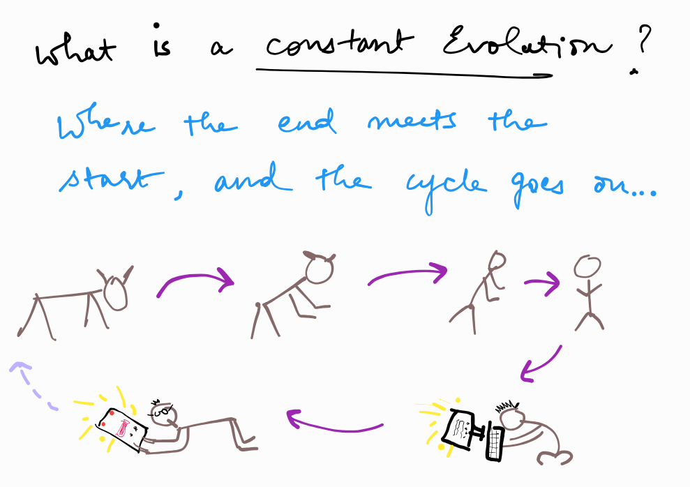

+++
title = "Constant Evolution"
description = "Species evolve to change or replace since this process never takes a break!"
draft = false

[taxonomies]
tags = ["sapiens", "biology", "evolution", "philosophy"]

[extra]
feature_image = "banner.png" # Article card image
feature = true
+++

