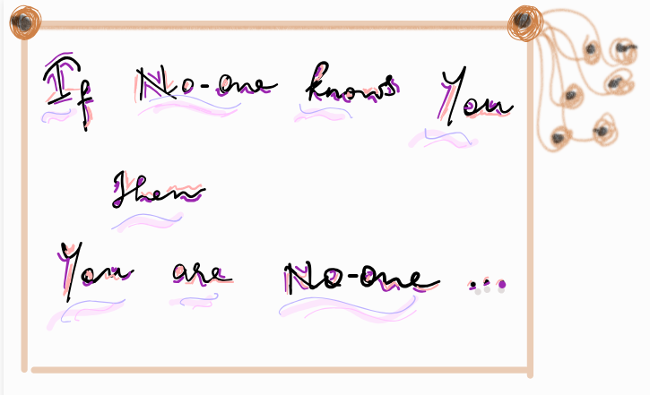

+++
title = "A thought"
description = "Thought that leaves us pondering"
draft = false

[taxonomies]
tags = ["illustration", "philosophy", "scribbles"]

[extra]
feature_image = "banner.png" # Article card image
feature = true
+++

